<p align="center">
  
  <h1 align="center">MstscManager</h1>
</p>

## 项目介绍

MSTSC远程管理器

一个支持MSTSC，Putty，Xshell，Xftp，Radmin，VNC，Winscp，SecureCRT，MobaXterm，Todesk的远程管理器

## 已支持的功能

- [x] 支持常用的连接软件，如RDP,Putty,Xshell,Xftp,Radmin,VNC,Winscp,SecureCRT
- [x] 支持服务器的增、删、改、查等管理操作
- [x] 服务器分类、搜索、排序、更改分类功能
- [x] 支持用户账号密码管理
- [x] 支持ping状态显示
- [x] 支持服务器到期提醒
- [x] 支持超级管理员密码，开启软件输入密码
- [x] 可以导入-导出服务器配置
- [x] 支持大部分MSTSC的配置功能
- [x] 可以一键导入本地的MSTSC链接
- [x] 支持临时连接，添加服务器
- [x] 拖拽分类服务器
- [x] 支持自定义命令
- [x] 三方EXE和数据库可以自由指定位置

### v1.2更新

- [x] 添加加配置导出自定义命令
- [x] 添加对MobaXterm，todesk的支持
- [x] 添加对putty-ssh，MobaXterm 密钥连接的支持
- [x] 添加对多级（二级）菜单分类的支持
- [x] 添加了对dpi缩放适配
- [x] 添加了当前分类详细情况的统计
- [x] 添加了托盘功能
- [x] 添加了批量检测
- [x] 优化导入导出txt卡顿问题，将txt导入导出改成了csv导入导出
- [x] 优化整体软件交互速度

### 更新说明

 [Updates.md](Updates.md) 

## 如何下载

1）你可以下载源码，自行编译后使用。

2）点击右侧release，找到对应的zip文件，下载后，使用里面的【MSTSC远程管理器.exe】主程序文件

备注：`MSTSC_win_x86.zip`,`MSTSC_win_x64.zip`,`MSTSC_winn_x86_withdotnet6.zip`

,`MSTSC_win_x64_with_dotnet6.zip`，四个版本中前两个不带.NET环境，需要自行安装.NET6 Runtime环境，小白无脑选择后面2个就行。

## 使用说明

- 增删改查

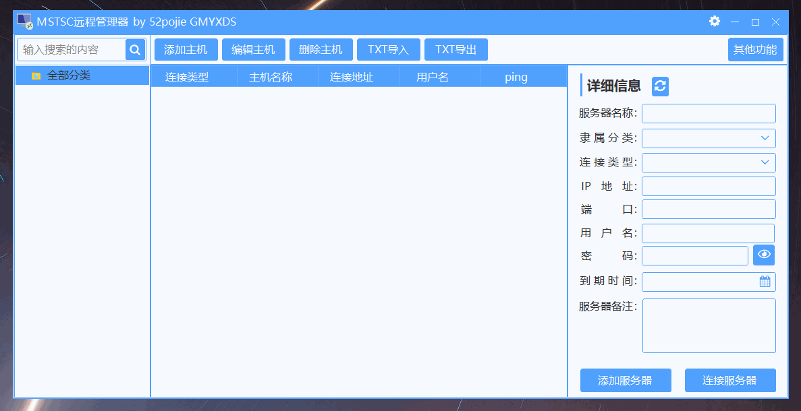

- 删除 按住ctrl 可以多选主机删除

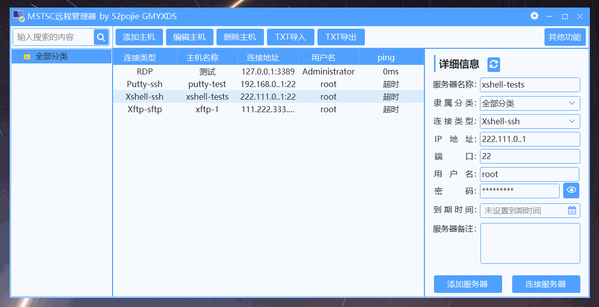

- 分类-搜索

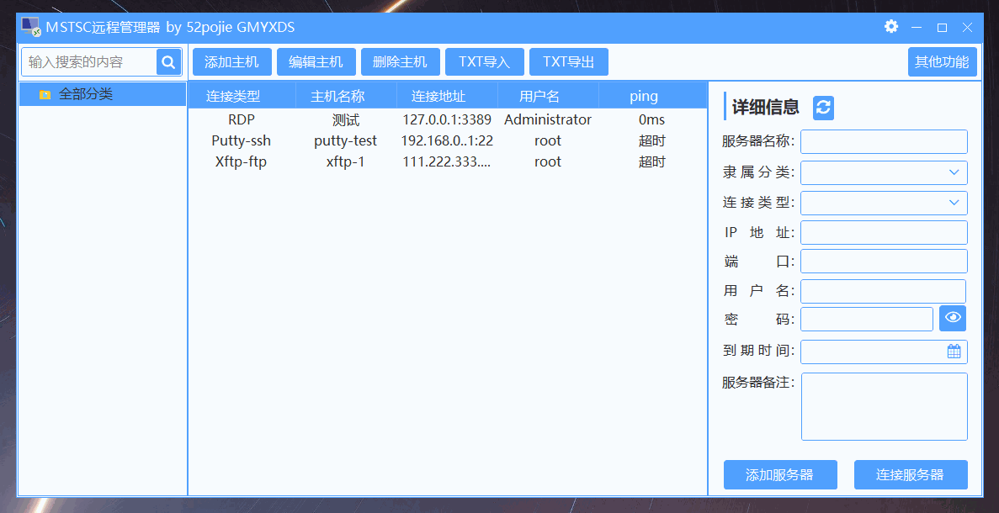

- 账户管理


- 选择账户

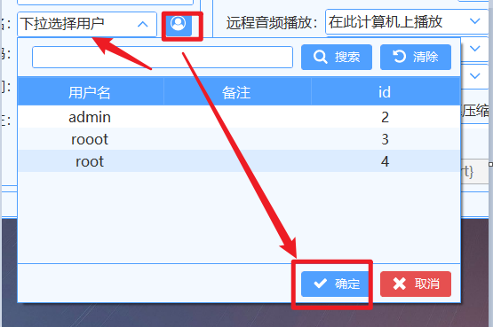

- ping 到期状态

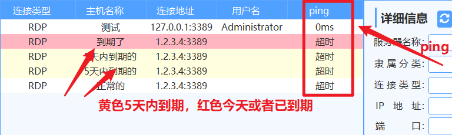

- 设置开启密码

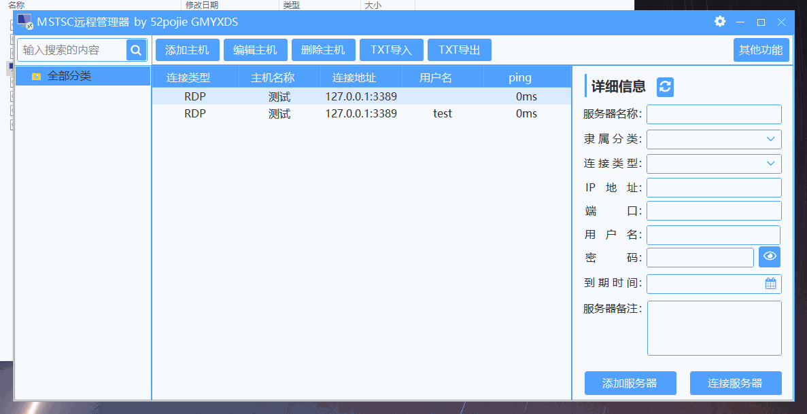

- 导入导出服务器列表

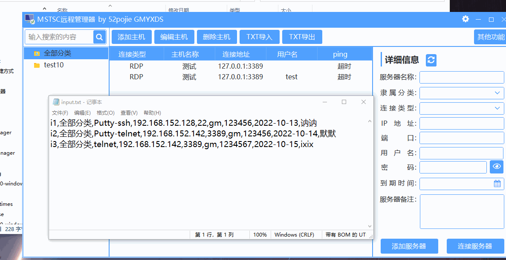

- 临时添加和连接服务器

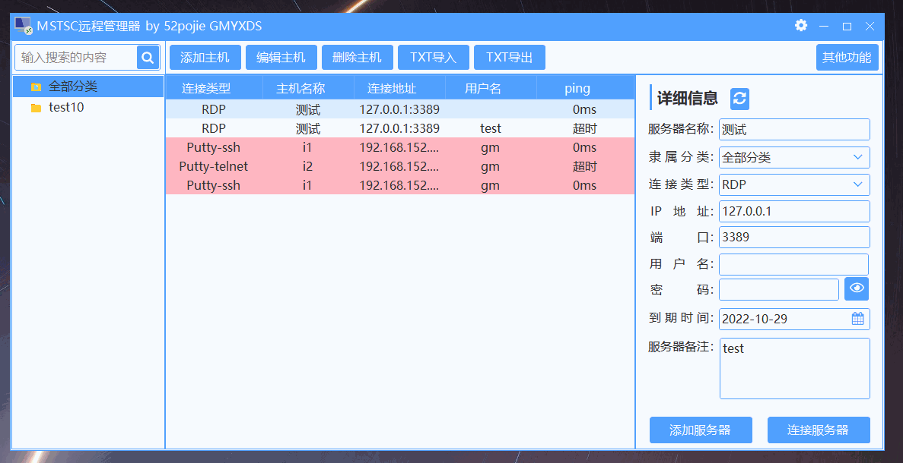

- 自定义命令

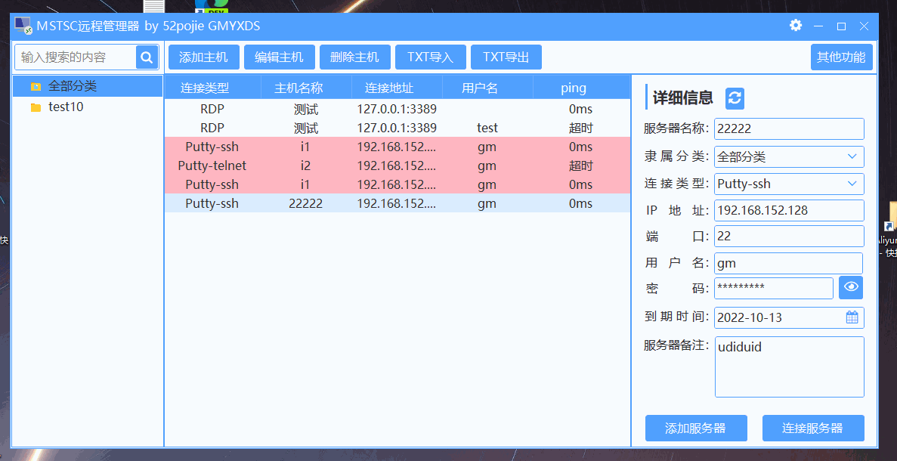

- 设置三方exe路径

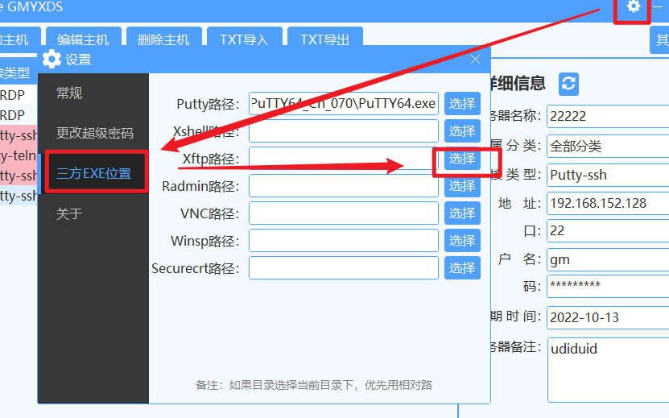

- 其他功能自行体验

## 注意

- putty 目前只支持密码登录,密钥登录需要使用自定义配置

- 如果xftp ftp模式连接不上，需要自定义用session连接.。如下

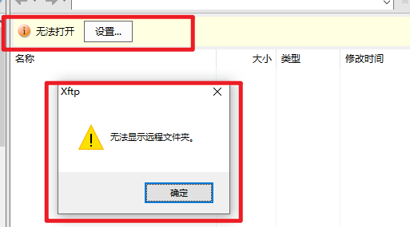

手动建立ftp 连接，然后点打开会话位置，复制会话的路径，使用自定义配置如下

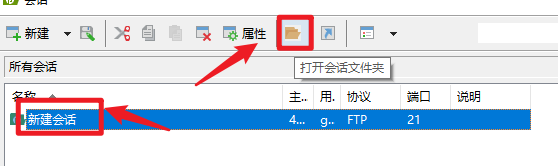

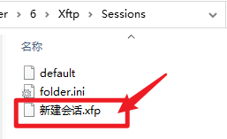

```
 "xfp路径/新建会话.xfp"
```

- vnc的话，Realvnc 没有支持密码的命令行选项，需要自定义用配置文件连接

- Tightvnc 不支持全屏和查看模式的命令行 需要自定义配置文件连接

- SecureCrt 命令行指定密钥没用，不知道为什么

- 所有的目录尽量不要放在有空格的目录里面

- Xshell，Xftp命令行不支持私钥连接

- 向日葵暂不支持命令行连接

## 如何编译

软件采用C#  .Net 6 的Winform 编写的，使用了SunnyUI作为UI框架，开发环境使用的是VS2022.

一般来说直接导入解决方案应该可以正常运行和编译

nuget包使用了，自行导入使用

```
Microsoft.Data.Sqlite.Core
Newtonsoft.Json
SQLitePCLRaw.bundle_e_sqlcipher
SunnyUI
```

## 联系作者

- 程序由我个人独立开发，能力有限，难免出现一些Bug，欢迎大家积极反馈Bug和提出优化建议。
- 对软件有建议或意见：[产品建议](https://support.qq.com/product/451575)
- 

## 最后

如果对这个项目感兴趣欢迎star，有疑问欢迎issue，pr
